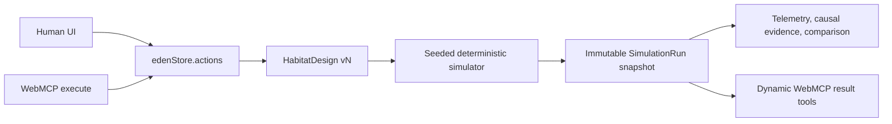

# EDEN

> **AI builds. Reality attacks. Human decides.**

EDEN is a visual, deterministic closed-loop habitat simulator built for the
[OpenAI WebMCP Challenge](https://openai.com/webmcp-challenge/). A human sets the
mission and its trade-offs, an agent edits the same visible habitat through
typed site tools, and a seeded simulator—not the language model—decides whether
the crew survives.

EDEN is not a chatbot and does not call the OpenAI API. It is a static React app
that progressively enhances itself when `document.modelContext` is available.

## The two-and-a-half-minute story

1. The starter habitat fails at sol 94 during a 45-sol dust storm.
2. The agent reads causal evidence, connects a microreactor and reruns with the
   same seed. Power is fixed, but oxygen reserve fails at sol 300.
3. The human locks the greenhouse and caps the budget at $7.95M.
4. The agent respects the lock, connects lower-cost oxygen storage and reruns.
5. The final design survives all 500 sols at $7.90M and 40.5t.
6. EDEN compares the immutable first/final design snapshots in the same UI.

The path is reproducible, but the result is not hard-coded. All outcomes come
from `runSimulation(design, seed)`.

| Seeded design | Outcome | Cost | Mass |
|---|---:|---:|---:|
| Starter | `POWER_COLLAPSE` · S94 | $6.35M | 28.5t |
| Starter + connected microreactor | `OXYGEN_RESERVE_BREACH` · S300 | $7.55M | 34.5t |
| Microreactor + redundant O₂ generator | Survives · S500 | $8.20M | 35.5t |
| Microreactor + O₂-connected storage | Survives · S500 | $7.90M | 40.5t |

## Run locally

Requirements: Node.js 22.19 or newer.

```bash
npm ci
npm run dev
```

Open `http://localhost:4173`.

Useful repeatable presentation states are built through the real store and
simulator actions:

- `/?demo=starter` — untouched starter habitat;
- `/?demo=failure` — starter failure at S94;
- `/?demo=success` — complete three-run human-agent story.

## Test and build

```bash
npm run check
npm run preview
```

`npm run check` runs lint, 15 deterministic/domain/WebMCP tests, TypeScript and
the Vite production build. The adapter test drives a standards-shaped
`ModelContext`, verifies 10 base tools, dynamic 11th/12th tool registration,
tool execution, observability, abort cleanup and the Chrome-native calling form
where execution options are omitted.

## Test with a WebMCP agent

Deploy the app over HTTPS and open it in ChatGPT's WebMCP-capable in-app
browser, or use Chrome with WebMCP enabled through its experimental flag or
origin trial. For local development, follow
[Chrome's WebMCP guide](https://developer.chrome.com/docs/ai/webmcp) and enable
`chrome://flags/#enable-webmcp-testing` and relaunch. The header badge reports
the live registration state; the human UI remains fully functional when the
experimental API is absent.

Prompt:

> Inspect the mission and current design. Run the default simulation with seed
> 424242. Use the causal evidence to repair the habitat so it survives all 500
> sols under the existing budget and mass limits. Preserve human-locked modules.
> Rerun with the same seed and compare the first and final runs.

EDEN registers 10 narrow base tools:

- read: `get_mission_state`, `list_module_catalog`, `inspect_design`;
- edit: `add_module`, `connect_modules`, `update_module`, `remove_module`;
- mission: `set_mission_constraints`, `run_simulation`, `reset_design`.

`analyze_latest_run` appears after the first run and `compare_runs` after the
second. Both use abortable registration. Every invocation is visible in the
developer panel with validated arguments, result, status and design version.

The production build has also passed the complete 10→12 tool story through
Chrome 151's native WebMCP runtime and Chrome DevTools MCP: S94 power failure,
S300 oxygen failure, human-lock rejection, S500 success and first/final run
comparison. See [Validation evidence](docs/VALIDATION.md) for the exact proof.

WebMCP is an experimental proposed standard. EDEN follows the current
[`document.modelContext.registerTool()` specification](https://webmachinelearning.github.io/webmcp/)
and isolates its browser types under `src/webmcp/`.

## Shared-world architecture



React Flow is presentation, never the source of truth. UI events and site-tool
handlers call the same actions. Every mutation increments the design version
and records an actor-tagged activity item. Human locks fail closed for agent
edits unless an explicit `overrideLocked: true` follows human authorization.
Undo/redo changes the current design without rewriting historical run
snapshots.

The simulator models resource reachability per bus. A storage module connected
only to water cannot silently contribute oxygen, food or spare-parts inventory.
Scenario bands, coefficients and simplified assumptions are public in the UI
and source.

More detail:

- [Architecture](docs/ARCHITECTURE.md)
- [WebMCP tool strategy](docs/WEBMCP_TOOL_STRATEGY.md)
- [Validation evidence](docs/VALIDATION.md)
- [Timed demo script](docs/DEMO_SCRIPT.md)
- [Submission copy](docs/SUBMISSION_COPY.md)
- [Feasibility and scope](docs/FEASIBILITY.md)

## Deploy

EDEN has no backend, secrets, login or runtime service dependency.

```bash
npm ci
npm run build
```

Publish `dist/` on an HTTPS static host. `netlify.toml` pins Node 22.19, runs the
production build and adds baseline security headers. Vite's preview server is
for local validation only.

## Scope and honesty

EDEN is an educational systems-design simulator. It uses aggregate resource
buses, one-sol timesteps, scripted disruptions and deliberately simplified
public coefficients. It is not scientific mission planning, ECLSS
certification, or safety-critical engineering software.

## License

[MIT](LICENSE)
