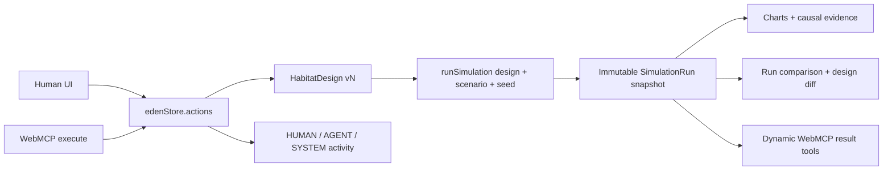

# EDEN architecture

## One shared world



There is no agent-only model. React components and WebMCP handlers call the
same store actions, so a tool effect is immediately visible on the canvas and a
human edit is immediately readable by the agent.

## Boundaries

### Domain

`src/domain/` owns stable types, the module catalog, starter design and mission
scenario. Catalog cost, mass and resource behavior are authoritative; tool
input cannot invent them.

### Simulation

`src/simulation/` exposes a pure daily-timestep calculation:

```ts
runSimulation(design, seed) -> SimulationRun
```

The engine deep-copies the evaluated design into each run. Identical design,
scenario and seed produce identical telemetry and causal outcomes; only
non-causal metadata such as run IDs and timestamps may differ.

Resource routing is evaluated per resource from the Habitat Core. A module is
productive only when its required resource path exists, and storage inventory
contributes only for resources explicitly connected to the core. An unrelated
edge can never activate all of a module's inventory.

`assumptions.ts` is the public coefficient ledger rendered by the Model
Assumptions panel.

### Store

`src/store/edenStore.ts` is the only mutable application state. It owns:

- the current design and monotonically increasing version;
- undo/redo snapshots for design mutations;
- immutable simulation runs and their active selection;
- HUMAN, AGENT and SYSTEM activity;
- WebMCP registration state and invocation records.

Undo/redo never rewrites historical run snapshots. An old result always retains
the exact design it evaluated.

### WebMCP adapter

`src/webmcp/registerEdenTools.ts` feature-detects
`document.modelContext`, validates every input with Zod and maps the request to
a store action. Ten tools register for the lifetime of the page. An
`AbortController` owns each result-aware registration:

- `analyze_latest_run` exists only while at least one run exists;
- `compare_runs` exists only while at least two runs exist.

The adapter records raw input, validated arguments, result, status and design
version in the same store for the visible developer panel. Browser-specific
types remain isolated in `src/webmcp/webmcp.d.ts`.

### UI

`src/components/` renders the store. React Flow handles graph presentation and
interaction, but never becomes the source of truth. The UI includes mission
constraints, graph editing, human locks, shared activity, preflight validation,
public assumptions, four telemetry charts, causal failures, run selection,
design snapshot comparison and WebMCP diagnostics.

`src/demo/loadDemoState.ts` provides repeatable screenshot routes. It calls
normal store actions and the real simulator; it does not inject fake outcomes.

## Integrity and control rules

- Every design mutation increments `design.version`.
- Every run records the evaluated version, seed and deep design snapshot.
- Human locks reject agent update, removal and endpoint-connection changes.
- `overrideLocked: true` is accepted only as an explicit collaboration escape
  hatch after human authorization; the lock is not presented as a security
  boundary.
- Disconnected or incorrectly routed modules stay visible but cannot contribute
  resources.
- Budget and mass are calculated from the catalog.
- The deterministic simulator alone decides success and failure.
- WebMCP absence never disables the human interface.
